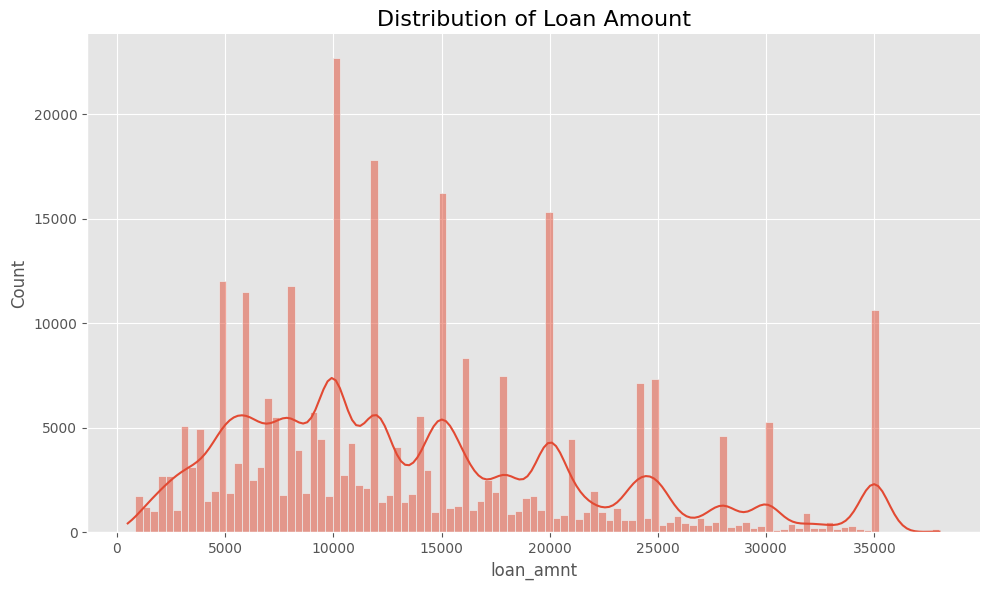
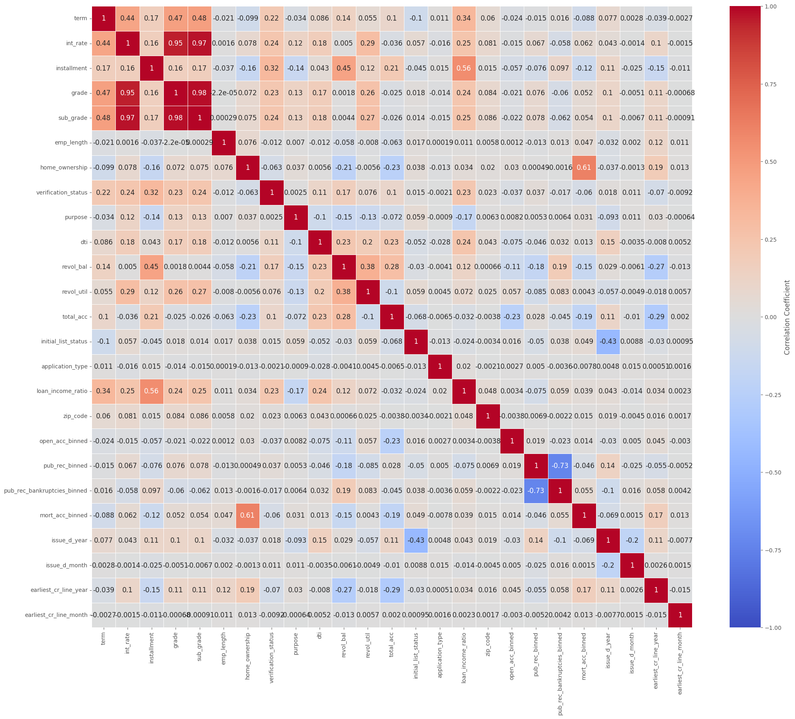
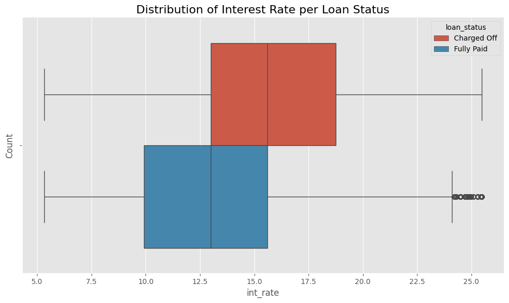
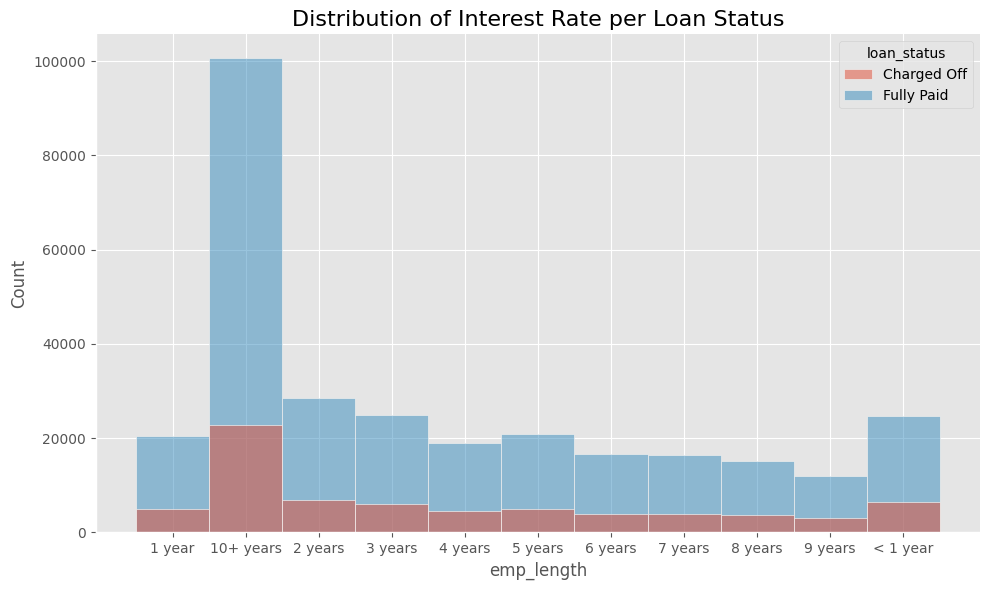

  

<h1 align="center">LoanTap Credit Risk Analysis</h1>

  
  
  
  

## 🚀 Project Overview
The **LoanTap Credit Risk Analysis** project aims to determine the creditworthiness of individuals and MSMEs (Micro, Small, and Medium Enterprises) applying for loans. LoanTap focuses on "White Collar" and "Grey Collar" customers who are considered high-risk, but with varying probabilities of defaulting on loans.

Using **data science techniques**, the project will profile potential customers and assess the risks associated with granting loans, offering a solution that balances profitability and customer satisfaction.

The primary goals are:
- **Predict** whether a loan should be approved for a customer.
- **Classify** customers into risk categories based on various personal and financial attributes.
- **Determine** optimal loan terms to minimize risk and maximize repayment probability.

---

## 📊 Dataset
The dataset consists of information regarding loan applicants and various features that can help assess their credit risk. Key features include:

- **loan_amnt**: Amount of loan requested.
- **int_rate**: Interest rate applied to the loan.
- **annual_inc**: Borrower's annual income.
- **emp_length**: Employment length in years.
- **home_ownership**: Housing status of the borrower.
- **dti**: Debt-to-Income ratio.
- **credit_history**: Length and reliability of the borrower’s credit history.
- **loan_status**: Final loan status (Fully Paid, Default, etc.).

### 💾 Data Location:
The data file is stored as `LoanTap.csv` in the `/data` folder.

---

## 🧠 Methodology

The project follows a structured machine-learning pipeline:

### 1. Data Exploration
- **Objective**: Gain insights into the dataset and understand feature relationships, distributions, and potential outliers.
- **Steps**:
  - Data shape, types, and missing value checks.
  - Summary statistics of numerical and categorical features.
  - Exploring target variable (`loan_status`) distributions and understanding class imbalances.
  
- **Key Findings**:
  - Majority of borrowers request medium-to-large loan amounts.
  - Income distributions vary widely, with some outliers indicating extremely high incomes.
  - Correlation between income, loan amount, and interest rate was examined.

### 2. Data Visualization
- **Objective**: Visualize key patterns in the data.
  
  #### Key Plots:
  - **Loan Amount Distribution**:
    

    A histogram showing the distribution of loan amounts requested by borrowers.

  - **Correlation Heatmap**:
    

    A correlation matrix to highlight relationships between variables like income, loan amount, DTI, and loan status.

  - **Interest Rate vs. Loan Status**:
    

    A boxplot to visualize how interest rates differ based on whether the loan was fully repaid or defaulted.

  - **Employment Length vs Loan Status**:
    

    A bar chart to observe how employment length influences repayment likelihood.

### 3. Data Preprocessing
- **Objective**: Prepare the dataset for model training.
  
  #### Steps:
  - **Handling Missing Values**: Imputation for missing values in `emp_length` and `annual_inc`.
  - **Encoding Categorical Variables**: One-hot encoding for categorical features like `home_ownership`, `purpose`.
  - **Feature Scaling**: Used Min-Max scaling to normalize continuous features.
  - **Class Balancing**: Applied **SMOTE** (Synthetic Minority Over-sampling Technique) to handle class imbalances in `loan_status`.

### 4. Model Development
- **Objective**: Build predictive models to classify customers and assess loan default probability.
  
  #### Models Implemented:
  - **Logistic Regression**: Simple and interpretable model for classification.
  - **XGBoost**: Boosting-based model designed to handle outliers, improve accuracy, and perform well on imbalanced data through optimized regularization and tree-based boosting.
  
  #### Model Evaluation:
  - **Accuracy**: How well the model correctly predicts the loan status.
  - **Precision**: Ratio of true positives to the sum of true and false positives.
  - **Recall**: Ability to detect defaults correctly.
  - **F1-Score**: Weighted average of precision and recall.
  - **Train ROC-AUC**: Area under the ROC curve for the training set.
  - **Test ROC-AUC**: Area under the ROC curve for the test set.

### 5. Hyperparameter Tuning
- **Objective**: Fine-tune the models to achieve the best performance.
- **Approach**: Used GridSearchCV to optimize hyperparameters such as `max_depth`, `n_estimators`, and `learning_rate`.

---

## ⚙️ Results and Evaluation

### Model Performance Metrics:
| Model                | Precision | Recall   | F1 Score | Train ROC-AUC | Test ROC-AUC |
|----------------------|-----------|----------|----------|---------------|--------------|
| Logistic Regression   | 37.25%    | 70.51%   | 48.75%   | 78.94%        | 78.55%       |
| XGBoost              | 89.79%    | 48.63%   | 63.09%   | 91.09%        | 91.20%       |

- **Interpretation**: The **XGBoost model** performed the best, providing the highest precision, recall and roc-auc score. It offers a reliable solution for predicting loan defaults and customer risk profiles.

---

## 🌟 Feature Importance Analysis
- **Objective**: Determine which features most influence loan default predictions.
  #### **Key Findings**:
  - **Zip Code**: The most important factor across models, indicating geographic location plays a significant role in predicting loan default risk.
  - **Grade**: Strongly influences loan default predictions, likely reflecting the creditworthiness of borrowers.
  - **Sub Grade**: Further refinement of the borrower’s credit grade contributes to risk assessment.
  - **Term**: Loan terms are a key factor, with longer terms likely indicating higher default risks.
  - **Home Ownership**: A significant predictor, indicating whether borrowers own a home affects their default probability.
  - **Loan Income Ratio**: The ratio of the loan amount to the borrower’s income is critical, with higher ratios signaling higher default risks.
  - **Debt-to-Income Ratio (DTI)**: Although it has lower importance compared to other features, DTI still plays a role, as high DTI increases default likelihood.

---

## 🔍 Insights and Recommendations:
### Key Insights:
1. **Zip Code as Core Predictor**: Geographic location (represented by zip code) has the highest influence on loan default prediction. Certain regions may inherently carry higher risks.
2. **Credit Grade and Sub Grade**: Customers with higher credit grades are less likely to default. This can be a key determinant in the lending process.
3. **Loan Term**: Longer loan terms may increase default probability, suggesting that shorter terms should be preferred for riskier borrowers.
4. **Home Ownership**: Borrowers who own homes tend to be lower risk compared to renters.

### Recommendations for LoanTap:
1. **Target Borrowers in Low-Risk Zip Codes**: Focus on regions that are less prone to defaults for safer lending.
2. **Incorporate Credit Grade into Risk Profiling**: Give priority to customers with higher grades to minimize default risk.
3. **Optimize Loan Terms Based on Risk**: For borrowers with higher risk profiles, consider offering shorter loan terms to reduce default chances.
4. **Incorporate Home Ownership into Risk Assessment**: Favor borrowers who own homes, as they are more likely to repay their loans reliably.

---

## 🙏 Acknowledgments
A big thanks to the LoanTap team for providing the dataset and project inspiration. Special appreciation to the open-source community behind the Python ecosystem, including **Pandas**, **Scikit-learn**, and **Matplotlib**, for their valuable tools.